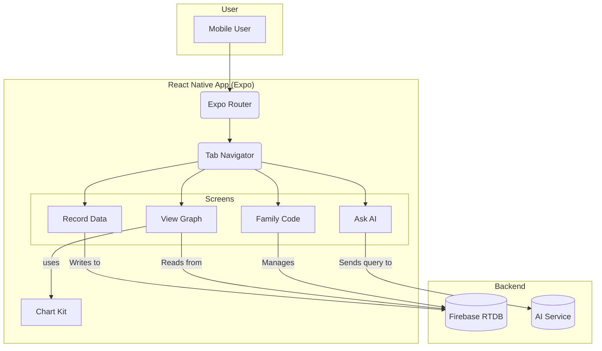

# Blood Pressure Monitoring App

## Project Aim
This project is a mobile application designed to help users log, track, and visualize their blood pressure readings. It aims to provide an easy-to-use interface for monitoring cardiovascular health, viewing historical trends, and potentially sharing data with family or healthcare providers.

## Technical Implementation
Built with React Native and the Expo framework, this application is written in TypeScript for robust, type-safe code. It features a tab-based navigation system managed by Expo Router. For data visualization, it integrates charting libraries like `react-native-chart-kit` to render historical data into intuitive graphs. The presence of Firebase database export files suggests that it uses Firebase Realtime Database for data storage and synchronization.

## Key Features
- **Data Logging:** Allows users to record their systolic and diastolic blood pressure measurements.
- **Historical Graphing:** Visualizes blood pressure trends over time using interactive charts.
- **AI Assistant:** Includes a feature to "Ask AI," suggesting an integrated assistant for health-related queries.
- **Data Sharing:** A "Family Code" feature implies functionality for sharing health data securely with others.

## Setup Instructions

- **Install dependencies:** `npm install`

- **Run the app:** `npx expo start`

## System Diagram

